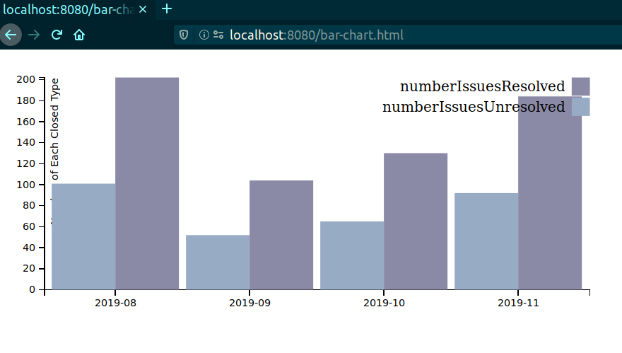
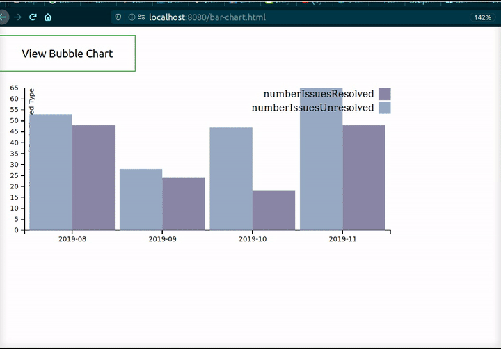

# Github Metrics: The Classification of Github Issues as Resolved or Unresolved Using Naive Bayes
I wrote a blog post about this project [here](https://dev.to/claire1/ai-github-api-issue-sentiment-classification-4913)!

I created this project for a Software Engineering class I took.

## Project Description
For this project, I got comments from issues on Github repositories. I used Naive Bayes to do sentiment analysis on the comments to decide if they were really resolved or if they were simply closed. After I classify the issues, I display the results in a bar chat and in a bubble chart. The bar chart lets you see the number of issues resolved and closed over time. The bubble chart lets you see the individual resolved and closed issues and click on links to see more information about each issue.

## How to run
This project is fully dockerized. You must have docker and docker-compose installed. 

To run this project, go to the `github-metrics` directory and then run `./run.sh`. 

You must have `sudo` access for this project to run. If you run this project a lot, you may wish to use `sudo docker volume rm $(sudo docker volume ls -qf dangling=true)` and `sudo docker system prune -a` to clean up unused docker images. 

To see the displayed pages, visit `http://localhost:8080/bubble.html` or `http://localhost:8080/bar-chart.html`.

## Demos
This gif shows the data as displayed by `bubble.html.` It has a different color for resolved and unresolved issues and displays links to more details about the issues when you hover over the bubbles. \

Image of bar chart produced by `bar-chart.html.` It has a different color for resolved and unresolved issues and groups the issues by month and year. \

Gif of the button working to go between the bar chart and the bubble chart. \

## Implementation Details
This project is mostly in Java.

1. In one docker container, this application fetches the comments from issues in a specified repository using this [Github Java API](https://github.com/github-api/github-api). 
2. Next, it runs a Naive Bayes classifier on the last comment on the closed issue to decide whether the issue was actually resolved or just closed. 
3. This classification is then put into a SQL database running in another docker container. 
4. Once all the issues have been processed, the program queries the database to calculate the number of closed issues. It groups them by the times they were closed. It outputs the result in a JSON file. 
5. Next, it queries the database again to get the url associated with each issue so that it can display all the closed issues with clickable links. 
6. To generate the display, the start-up script for the main docker container runs the http-server command to start a webserver that is accessible from the host machine of the docker container. 

Once this process completes, you can view the clustering of the issues by visiting [http://localhost:8080/bubble.html](http://localhost:8080/bubble.html) or [http://localhost:8080/bar-chart.html](http://localhost:8080/bar-chart.html) on your browser.

## Some Notes on Implementation and Future Work
### Github API
I used an [API](https://github.com/github-api/github-api) to access Github with Java. This API is not perfect. It does not tell you if it cannot get all the issues for a repository due to rate limiting. Thus, if there are a large number of closed issues, this project won't display all of them since it doesn't know that there are more and doesn't have a way to get the others. Also, this API also includes closed pull requests when it says it is getting all the closed issues. 

### Naive Bayes Classification Algorithm
I choose Naive Bayes to be my classification algorithm because it is the algorithm traditionally used for spam detection, which is similar to this process of classifying issues.

For the classification algorithm, I found that the results of the classifier heavily depended on the data specified in the training data file. Since I did not want to spend too much time finding examples of issues that were closed without being resolved, I developed a more lenient rubric for determining labels for the data. For classifying Github issues, I looked at the closed issues in [liyasthomas/postwoman](https://github.com/liyasthomas/postwoman) and copied over the final comments. Most of the issues in this repository seem to be resolved so I made the decision to classify issues that were closed because they were duplicates as unresolved issues. Thus, it is clear that there will be bias in the classification based on how the training data is classified.

To show that my classifier worked for data classification in general, I found a file with pre-labeled spam detection data and used that in tests that can be found in `MainTest.java`. 

In the future, it might be helpful to explore links to related pull requests mentioned in issues since they often give a good suggestion as to whether or not an issue was resolved.

## Sources
Java Github API: https://github.com/github-api/github-api \
Source for bubble chart: https://www.freecodecamp.org/news/a-gentle-introduction-to-d3-how-to-build-a-reusable-bubble-chart-9106dc4f6c46/ and https://github.com/dmesquita/reusable_bubble_chart \
Source for working classification: based on this tutorial http://jmgomezhidalgo.blogspot.com/2013/04/a-simple-text-classifier-in-java-with.html with this repo https://github.com/jmgomezh/tmweka/tree/master/FilteredClassifier \
Source for bar chart: https://stackoverflow.com/questions/39169948/grouped-bar-chart-from-json-data-instead-of-csv
Example arff file for training data: http://users.eecs.northwestern.edu/~ahu340/eecs349-ps1/train.arff \
About how to get a Github OAuth token: https://help.github.com/en/github/authenticating-to-github/creating-a-personal-access-token-for-the-command-line \
About how to specify Github OAuth token as an environment variable: https://issues.jenkins-ci.org/browse/JENKINS-37581 \
Source for how to use Naive Bayes from Weka in Java: https://www.codingame.com/playgrounds/6734/machine-learning-with-java---part-5-naive-bayes \
Weka and getting Instances from SQL database: https://waikato.github.io/weka-wiki/use_weka_in_your_java_code/ \
Source for SQL in docker container: https://stackoverflow.com/questions/36617682/docker-compose-mysql-import-sql  \
